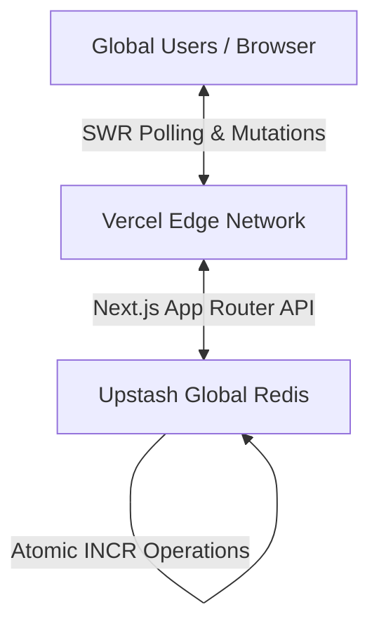

<div align="center">
  

  # Salawat App - The Global Counter 📿

  **An Enterprise-Grade, Hyper-Scalable, Real-Time Platform for Global Salawat Counting.**

  [](#)
  [](#)
  [](#)
  [](#)
  [](#)
  [](https://opensource.org/licenses/MIT)
  [](http://makeapullrequest.com)

  [Live Demo](https://salawat-app.vercel.app) · [Documentation](#) · [Report Bug](https://github.com/your-username/salawat-app/issues/new) · [Request Feature](https://github.com/your-username/salawat-app/issues/new)
</div>

---

## 📑 Table of Contents

- [About The Project](#-about-the-project)
  - [Mission & Vision](#mission--vision)
  - [Scaling to Billions](#scaling-to-billions)
- [Architecture Overview](#-architecture-overview)
- [Tech Stack](#-tech-stack)
- [Getting Started](#-getting-started)
  - [Prerequisites](#prerequisites)
  - [Standard Installation](#standard-installation)
  - [Docker Installation](#docker-installation)
- [Deployment](#-deployment)
- [Roadmap](#-roadmap)
- [Contributing](#-contributing)
- [Governance & Support](#-governance--support)
- [License](#-license)

---

## 📖 About The Project

**Salawat App** is a state-of-the-art web application engineered to serve a singular, noble purpose: to act as a unified, real-time global counter for sending blessings (Salawat) upon the Prophet Muhammad (Peace Be Upon Him).

### Mission & Vision
The mission is to connect millions of users worldwide in real-time, functioning not just as a counter, but as a robust platform that unites people globally through a synchronized spiritual action.

### Scaling to Billions
Handling a massive influx of concurrent users clicking simultaneously requires an enterprise-level architecture. This repository is built around **Edge Computing** and **In-Memory Datastores (Redis)** to guarantee that millions of requests per second are processed with sub-millisecond latency, resulting in zero downtime and absolute data consistency.

---

## 🏗 Architecture Overview



*For an in-depth dive into the system's architecture, data flow, and optimization strategies, please read our comprehensive [**ARCHITECTURE.md**](./ARCHITECTURE.md).*

---

## 🛠 Tech Stack

Our stack is meticulously chosen to provide maximum performance and developer experience:

- **Core Framework:** [Next.js 15+ (App Router)](https://nextjs.org) - Utilizing React Server Components and Edge functions.
- **Frontend Library:** [React 19](https://react.dev) - Taking advantage of the latest concurrent rendering features.
- **Styling Engine:** [Tailwind CSS v4](https://tailwindcss.com/) - Utility-first CSS for rapid, scalable UI construction.
- **Animation Physics:** [Framer Motion](https://www.framer.com/motion/) - For liquid-smooth, GPU-accelerated micro-interactions.
- **Primary Datastore:** [Upstash (Serverless Redis)](https://upstash.com/) - Providing sub-millisecond atomic operations globally.
- **Data Synchronization:** [SWR (Stale-While-Revalidate)](https://swr.vercel.app/) - Ensuring optimistic UI updates and robust background syncing.

---

## 🚀 Getting Started

### Prerequisites

- Node.js > 18.x
- npm or pnpm
- An [Upstash](https://upstash.com/) Account (Free tier is sufficient for development)

### Standard Installation

1. **Clone the repository**
   ```bash
   git clone https://github.com/your-username/salawat-app.git
   cd salawat-app
   ```

2. **Install dependencies**
   ```bash
   npm install
   ```

3. **Configure Environment Variables**
   Copy the example environment file and fill in your Upstash Redis credentials:
   ```bash
   cp .env.example .env.local
   # Edit .env.local with your UPSTASH_REDIS_REST_URL and UPSTASH_REDIS_REST_TOKEN
   ```

4. **Run the development server**
   ```bash
   npm run dev
   ```

### Docker Installation

For an isolated development environment, you can use Docker:

```bash
docker-compose up --build
```
The App will be available at `http://localhost:3000`.

---

## 🚢 Deployment

The optimal deployment target for this stack is the **Vercel Edge Network**, which ensures minimal latency globally.

[](https://vercel.com/new/clone?repository-url=https://github.com/your-username/salawat-app)

Alternatively, using the Vercel CLI:
```bash
npm i -g vercel
vercel
```

---

## 🗺 Roadmap

- [x] Initial React 19 + Next.js 15 Setup
- [x] Integrate Upstash Redis for atomic counting
- [x] Setup Framer Motion & Tailwind v4 UI
- [ ] Implement Global Leaderboards (Countries/Regions)
- [ ] Implement Real-Time Websocket Fallbacks
- [ ] Localization (L10n) & Internationalization (i18n) setup
- [ ] Add Comprehensive Unit & E2E Testing (Jest / Cypress)
- [ ] Mobile App Port (React Native / Expo)

---

## 🤝 Contributing

We welcome contributions from the global community. Whether it's adding a new feature, fixing a bug, or improving the documentation, your help is appreciated.

Please review our:
- [**Contributing Guidelines**](CONTRIBUTING.md)
- [**Code of Conduct**](CODE_OF_CONDUCT.md)
- [**Security Policy**](SECURITY.md)

---

## 🏛 Governance & Support

- Technical documentation and architectural decisions are logged in [**ARCHITECTURE.md**](ARCHITECTURE.md).
- If you need help or have questions, please read [**SUPPORT.md**](SUPPORT.md).
- To understand how the project is managed, see [**GOVERNANCE.md**](GOVERNANCE.md).

---

## 📄 License

This repository is distributed under the MIT License. See the [`LICENSE`](LICENSE) file for more information.

---
<div align="center">
  <i>Made with 🤍 for the global community.</i>
</div>
