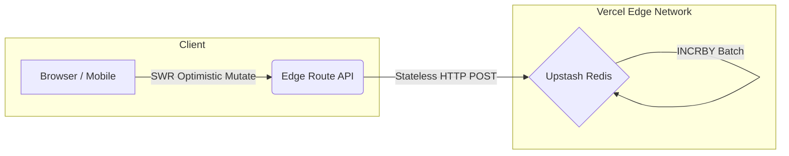

<div align="center">
  

  <br />
  <br />

  # 🕌 Salawat App: Global Real-Time Counter

  **An Enterprise-Grade, Hyper-Scalable Platform for Synchronized Global Action.**

  <p align="center">
    <a href="https://github.com/your-username/salawat-app/actions/workflows/ci.yml">
      
    </a>
    <a href="https://nextjs.org/">
      
    </a>
    <a href="https://react.dev/">
      
    </a>
    <a href="https://upstash.com/">
      
    </a>
    <a href="https://tailwindcss.com/">
      
    </a>
  </p>
  
  <p align="center">
    <a href="https://opensource.org/licenses/MIT">
      
    </a>
    <a href="https://github.com/your-username/salawat-app/issues">
      
    </a>
    <a href="https://github.com/your-username/salawat-app/pulls">
      
    </a>
    <a href="http://makeapullrequest.com">
      
    </a>
    <a href="https://github.com/your-username/salawat-app/stargazers">
      
    </a>
  </p>

  <p align="center">
    <strong>[ <a href="https://salawat-app.vercel.app">Live Demo</a> ]</strong> ·
    <strong>[ <a href="#-documentation">Documentation</a> ]</strong> ·
    <strong>[ <a href="https://github.com/your-username/salawat-app/issues/new?template=bug_report.md">Report Bug</a> ]</strong> ·
    <strong>[ <a href="https://github.com/your-username/salawat-app/issues/new?template=feature_request.md">Request Feature</a> ]</strong>
  </p>
</div>

***

## 📑 Table of Contents
<details>
<summary>Click to expand</summary>

- [1. About The Project](#-about-the-project)
  - [Mission Statement](#mission-statement)
  - [The Engineering Challenge](#the-engineering-challenge)
- [2. System Architecture](#-system-architecture)
- [3. Key Features](#-key-features)
- [4. Project Structure](#-project-structure)
- [5. Installation & Setup](#-installation--setup)
- [6. Documentation](#-documentation)
- [7. Community & Governance](#-community--governance)
- [8. Contributing](#-contributing)
- [9. Backers & Sponsors](#-backers--sponsors)
- [10. License](#-license)
</details>

---

## 📖 About The Project

**Salawat App** is more than just a counter; it is a global, real-time synchronization engine built to process millions of concurrent micro-transactions (clicks) globally. Our mission is to seamlessly unite users around the world intending to send peace and blessings (Salawat) upon the Prophet Muhammad (Peace Be Upon Him).

### The Engineering Challenge
Handling a "Thundering Herd" of millions of concurrent connections pressing a button simultaneously will easily crash traditional relational databases (like PostgreSQL/MySQL). This application solves this by circumventing persistent TCP connections entirely, using stateless **Edge Computing** and **Serverless Redis (Upstash)** via HTTP/REST. 

*Read our detailed [Architecture Guide](docs/ARCHITECTURE.md) to learn how we mitigated high-concurrency race conditions.*

---

## 🏗 System Architecture

The backbone of Salawat App relies on rendering proximity-close to the user and executing atomic operations in-memory.



---

## ✨ Key Features

| Feature | Description | Tech Implementation |
| :--- | :--- | :--- |
| **Atomic Counting** | Zero race conditions. Every single click is guaranteed to process. | `Redis INCR` |
| **Optimistic UX** | The counter increments instantly for the user, hiding network latency. | `SWR Mutations` |
| **Physics UI** | Fluid, GPU-accelerated micro-animations on user interactions. | `Framer Motion` |
| **Global Deployment** | Functions run in data centers closest to the user's origin. | `Vercel Edge` |
| **Zero-Bundle CSS** | Utilizing the latest generation of utility styling. | `Tailwind CSS v4` |

---

## 📁 Project Structure

Our repository follows a highly modular, enterprise-standard structure:

```text
salawat-app/
├── .github/                # GitHub Actions, Issue Templates, Dependabot config
├── docs/                   # Detailed architectural & operational documentations
│   ├── ARCHITECTURE.md     # Engineering decisions
│   ├── STATE_MANAGEMENT.md # SWR vs Redux rationale
│   └── ...                 
├── public/                 # Static assets (fonts, icons, SVGs)
├── src/
│   ├── app/                # Next.js 15 App Router directory (Pages & API)
│   ├── components/         # Reusable React UI components (Counter, Motion UI)
│   ├── hooks/              # Custom React Hooks
│   └── styles/             # Global CSS and Tailwind directives
├── docker-compose.yml      # Local container orchestration
├── Dockerfile              # Multi-stage production image build
└── package.json            # Project dependencies & scripts
```

---

## 🚀 Installation & Setup

We recommend utilizing Node.js 20+ with `.nvmrc` support.

### 1. Prerequisites
- Node.js (v18 or v20 LTS recommended)
- `npm` or `pnpm`
- An [Upstash Redis](https://upstash.com/) Database

### 2. Standard Development
```bash
# Clone the repository
git clone https://github.com/your-username/salawat-app.git

# Enter directory
cd salawat-app

# Install dependencies
npm ci

# Setup Local Variables
cp .env.example .env.local
# (Inject your Upstash tokens into .env.local)

# Start Dev Server
npm run dev
```

### 3. Docker Development
For completely isolated environments:
```bash
docker-compose up --build
```
*(App will be exposed on port `3000`)*

---

## 📚 Documentation

Dive deeper into our project's internals using the specialized guides below:

- **[Architecture & Systems Design](docs/ARCHITECTURE.md)**
- **[State Management Strategy](docs/STATE_MANAGEMENT.md)**
- **[Performance & Scaling Strategy](docs/PERFORMANCE.md)**
- **[Deployment Guide](docs/DEPLOYMENT.md)**
- **[API Reference](docs/API_REFERENCE.md)**
- **[Localization (Upcoming)](docs/LOCALIZATION.md)**
- **[Testing Guidelines](docs/TESTING.md)** *(Coming Soon)*

---

## 🏛 Community & Governance

This project is open-source and community-driven. All decisions are transparent.

- **[Code of Conduct](CODE_OF_CONDUCT.md)**: We enforce a strict, welcoming environment.
- **[Governance Model](GOVERNANCE.md)**: How decisions are made.
- **[Maintainers](MAINTAINERS.md)**: Meet the core team.
- **[Security Policy](SECURITY.md)**: How to report vulnerabilities safely.

---

## 🤝 Contributing

We heartily welcome Pull Requests. Whether it is a typo, a bug-fix, or a massive restructuring, your contribution is valued.

1. Fork the Project.
2. Create your Feature Branch: `git checkout -b feat/AmazingFeature`
3. Commit your Changes using Conventional Commits.
4. Push to the Branch: `git push origin feat/AmazingFeature`
5. Open a Pull Request adhering to our [PR Template](.github/PULL_REQUEST_TEMPLATE.md).

*Our CI/CD pipeline and GitHub Actions (`labeler`, `dependabot`, `stale`) will automatically tag and test your PR.*
*Please ensure you review the [Contributing Guidelines](CONTRIBUTING.md) before pushing.*

---

## ✨ Contributors

Thanks goes to these wonderful people ([emoji key](https://allcontributors.org/docs/en/emoji-key)):

<a href="https://github.com/your-username/salawat-app/graphs/contributors">
  
</a>

This project follows the [all-contributors](https://github.com/all-contributors/all-contributors) specification. Contributions of any kind welcome!

---

## 💖 Backers & Sponsors

This project is currently maintained voluntarily by independent developers. If you wish to sponsor server costs (Vercel/Upstash quotas) as the app scales globally, please check our [Sponsors Page](#) or the `FUNDING.yml` configuration in this repository.

---

<div align="center">
  <br />
  <code>Built with Next.js 15 & React 19</code><br />
  Distributed under the MIT License. See <code><a href="./LICENSE">LICENSE</a></code> for more information.
  <br /><br />
  ⭐⭐⭐ <i>If you appreciate the engineering behind this project, please consider giving it a Star!</i> ⭐⭐⭐
</div>
